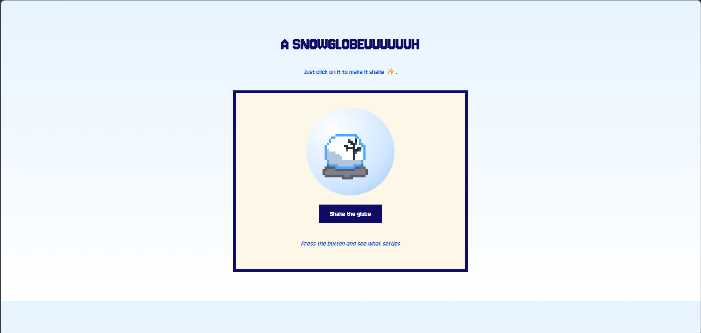
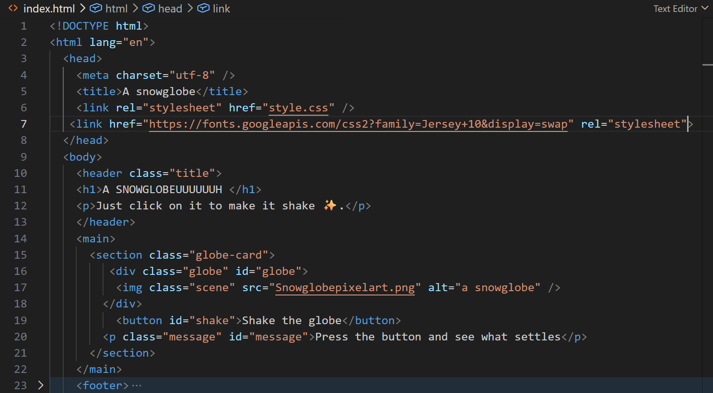

# A SNOWGLOBE
 The project **"A snowglobe"** is a little website made for the YSWS (You Ship We Ship) 'Snowglobe'. The purpose behind it is to confirm (re)learning how to make a webstie ​✨. 

It has one pages :

- When you arrive on the website, you have to click on the button, you'll see the snowglobe shaking, and a little message appears !

If you just want to visit the website, click <a href=https://aaa-like-the-batterie.github.io/snowglobe>here</a>.

# Screenshoots 

#### (of a part the code)

# What did I use ?

- HTML (to make the structure of the website) 
- CSS (to visually arrange the website)
- Javascript (to make the little animation and making appearing a different message each time you click on the button)
- Google Fonts (to put a font on the website text)
- Visual Code Studio (to make the code)
- Pixel Studio (to make the pixel art)

# How I made it ?

For most of the project,I've followed the beginner guides from [Snowglobe](https://snowglobe.hackclub.com/guides). The only thing I've did on my own was making a snowglobe in pixel art !

#What I have learned ?

I did learned a few things about Javascript since I'm already familiar with HTML and CSS.
The project was pretty easy to make ( the only moment I struggle a bit was when I tried to cahnge the font, it wasn't working at first because I didn't link of the font correctly in the index.html file) and the snowglobe pixel art since I'm still learning !

##### I've made this readme inspired by the template of Fynr1x : https://gist.github.com/FaizeenHoque/0709576cc598721df07fb62d2430e6fe

